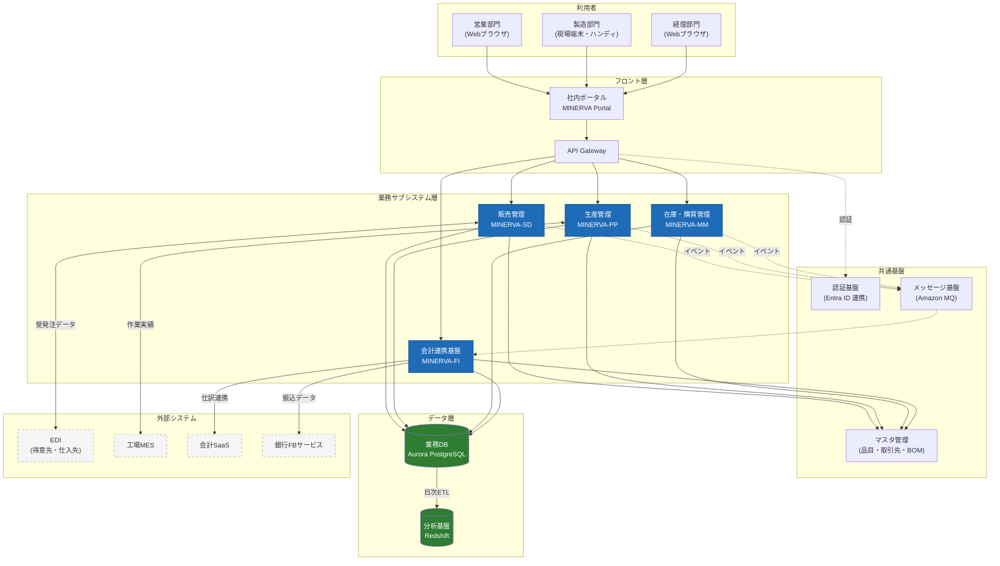

# MINERVA 基幹システム 全体アーキテクチャ

> **本ドキュメントの位置づけ**
> 株式会社ミナト精工の次期基幹システム「MINERVA」の全体構成を示す最上位ドキュメント。
> 各サブシステムの詳細は `10. 業務サブシステム` 配下の各ドキュメントを参照のこと。

## 1. 全体構成図

## 2. サブシステム一覧

| コード | 名称 | 主管部門 | 概要 |
| --- | --- | --- | --- |
| SD | 販売管理 | 営業本部 | 見積・受注・出荷・売上・請求 |
| PP | 生産管理 | 製造本部 | 生産計画・製造指図・実績収集 |
| MM | 在庫・購買管理 | 資材部 | 所要量展開・発注・入荷・在庫 |
| FI | 会計連携基盤 | 経理部 | 仕訳生成・債権債務・支払 |

## 3. 設計上の基本方針

- **モジュラーモノリス構成**：サブシステム間の同期呼び出しは API Gateway 経由に限定し、非同期連携はメッセージ基盤に寄せる
- **マスタは一元管理**：品目・取引先・BOM はマスタ管理サービスのみが更新権限を持つ
- **会計はイベント駆動**：業務トランザクションから仕訳を自動生成し、手仕訳は原則禁止

> ⚠️ **注意**: 旧システム（AS/400 上の CORE-21）とは 2027 年 3 月まで並行稼働する。並行稼働中のデータ連携方式は「外部システム連携一覧」を参照。
