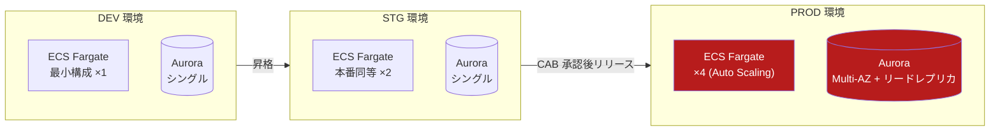

# 技術スタック・環境一覧

## 1. 技術スタック

| レイヤ | 採用技術 | 備考 |
| --- | --- | --- |
| フロントエンド | React 18 / TypeScript | 社内ポータル・各業務画面 |
| バックエンド | Kotlin / Spring Boot 3 | サブシステム共通 |
| API | REST + OpenAPI 3.1 | スキーマ駆動開発 |
| 非同期連携 | Amazon MQ \(ActiveMQ\) | 仕訳イベント・在庫引当イベント |
| DB | Aurora PostgreSQL 15 | サブシステムごとにスキーマ分割 |
| 分析基盤 | Redshift + dbt | 日次 ETL |
| IaC | Terraform | 環境差分は tfvars で管理 |
| CI/CD | GitHub Actions | main マージで STG 自動デプロイ |

## 2. 環境一覧

| 環境 | 用途 | URL | データ | 備考 |
| --- | --- | --- | --- | --- |
| DEV | 開発 | `dev.minerva.minato-seiko.internal` | ダミーデータ | 開発者が自由に利用可 |
| STG | 受入試験 | `stg.minerva.minato-seiko.internal` | 本番マスク済コピー | 毎週月曜にリフレッシュ |
| PROD | 本番 | `minerva.minato-seiko.internal` | 本番データ | 変更は CAB 承認必須 |

## 3. 環境ごとの構成差分

> 💡 **Tips**: STG のマスクルール（個人情報・取引先名の置換仕様）は情報システム部の管理する変換ジョブで定義。変更したい場合は #sys-minerva チャンネルへ。

## 4. バージョンポリシー

- ランタイム・主要ライブラリは **四半期ごと** に棚卸し
- セキュリティパッチは CVSS 7.0 以上を **5 営業日以内** に適用
- EOL 半年前のコンポーネントはリリース判定会議でエスカレーション
