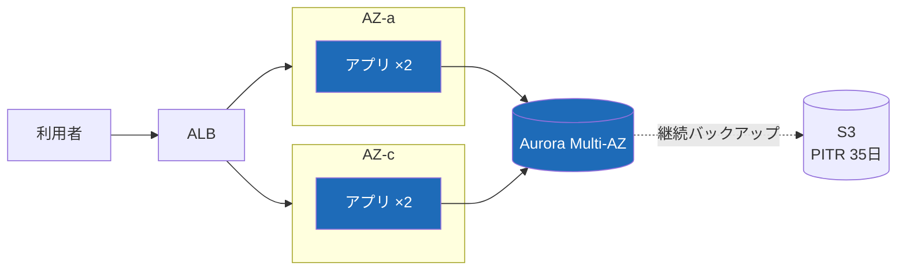

# 設計原則・非機能要件

## 1. 設計原則（Architecture Principles）

1. **業務の真実は基幹に一つ** — 同じ事実（受注・在庫・原価）を複数システムに二重持ちしない。参照はすべて API 経由。
2. **夜間バッチを増やさない** — 新規の集計・連携はイベント駆動を第一候補とし、バッチ追加は運用委員会の承認制。
3. **画面より先にデータ設計** — 新機能はまずエンティティとイベントを定義し、レビューを通してから実装に入る。
4. **監査証跡は自動で残る** — 業務データの更新はすべて操作ログと変更前後の値を自動記録。アプリ実装者が意識しない仕組みにする。

## 2. 非機能要件サマリ

| 項目 | 目標値 | 測定方法 |
| --- | --- | --- |
| 可用性（業務時間帯） | 99.9% | CloudWatch SLO ダッシュボード |
| 画面応答（95パーセンタイル） | 1.5 秒以内 | RUM 計測 |
| 夜間バッチ完了時刻 | 翌 6:00 まで | ジョブ管理ツールの完了実績 |
| RPO / RTO | 15 分 / 4 時間 | 年 2 回の DR 訓練で検証 |
| 同時接続 | 800 セッション | 繁忙期（月末月初）実績ベース |

## 3. 可用性の考え方

> ⚠️ **月末月初の凍結期間**: 毎月末営業日 12:00 〜 翌月第 2 営業日 18:00 は本番リリース禁止（決算・請求処理保護のため）。緊急リリースは部長承認＋経理部合意が必要。

## 4. セキュリティ要件（抜粋）

- 認証は Entra ID の SSO に統一。ローカルアカウントは運用ブレークグラス用の 2 つのみ
- 権限は職務分掌ベースのロール設計（発注者と検収者は分離）
- 個人情報を含むテーブルは列レベル暗号化＋アクセスログ 7 年保管
