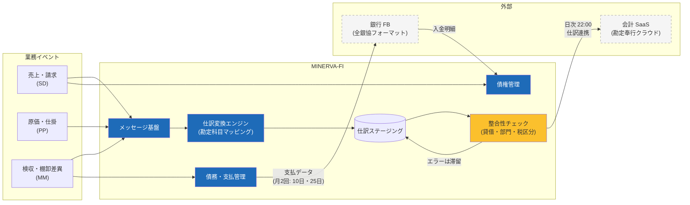

# 会計連携基盤（MINERVA-FI）構成

業務トランザクションから仕訳を自動生成し、会計 SaaS・銀行と連携する基盤。主管は経理部。

## 1. 仕訳連携アーキテクチャ

## 2. 勘定科目マッピングの管理

- マッピング表（イベント種別 × 品目区分 × 部門 → 勘定科目・補助科目）は経理部がメンテナンス
- 変更は **翌会計期間から適用**。期中変更は経理部長承認＋変更履歴の記録が必須
- マッピング未定義のイベントはエラー滞留し、翌朝の経理デイリーチェックで補正

## 3. 締めスケジュール

| 処理 | タイミング | 備考 |
| --- | --- | --- |
| 仕訳連携（日次） | 毎日 22:00 | エラー滞留分は翌日再送 |
| 月次締め | 翌月第 2 営業日 18:00 | 締め後の業務伝票訂正は翌月度仕訳 |
| 支払実行 | 毎月 10 日・25 日 | 承認締切は前営業日 15:00 |

> ⚠️ **重要**: 支払データ送信後の取消は銀行側手続きが必要（当日 14:30 まで）。送信前の承認締切を厳守すること。誤送信時の対応は「障害発生時の対応フロー」の P1 手順に従う。
