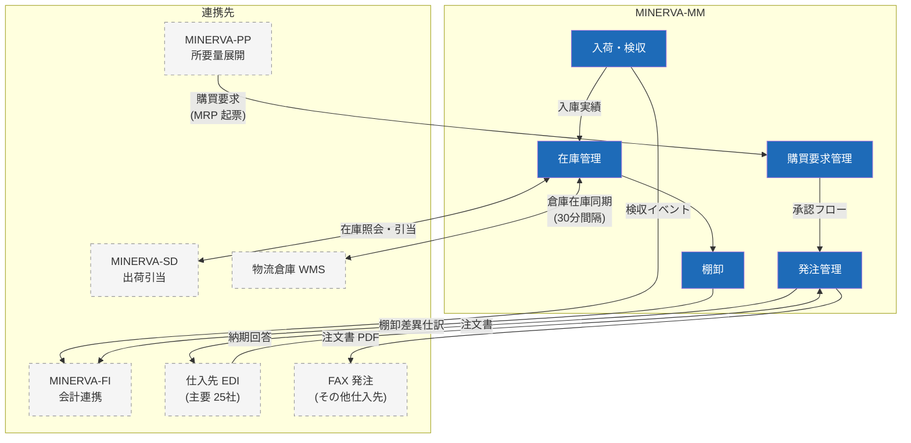

# 在庫・購買管理サブシステム（MINERVA-MM）構成

資材の発注から入荷・在庫管理までを担う。主管は資材部。

## 1. 機能構成図

## 2. 発注承認フロー

| 発注金額（税抜） | 承認者 |
| --- | --- |
| 〜50 万円 | 資材部 担当課長 |
| 〜300 万円 | 資材部長 |
| 300 万円超 | 資材部長 ＋ 管理本部長 |

- 承認は MINERVA のワークフロー機能で完結（紙・メール承認は廃止済み）
- **発注者と検収者は同一人物にできない**（職務分掌。システムで強制）

## 3. 在庫評価・棚卸

- 在庫評価は **月次総平均法**。月次締め後の入荷訂正は翌月扱い
- 実地棚卸は年 2 回（9 月・3 月）、循環棚卸は A ランク品目のみ月次
- 棚卸差異が金額 10 万円または数量 5% を超える品目は、差異理由の登録が必須

> ⚠️ **注意**: WMS との在庫同期は 30 分間隔の準リアルタイム。棚卸凍結中（実地棚卸日の 18:00〜翌 8:00）は同期を停止するため、この間の出荷指示は翌朝反映になる。
