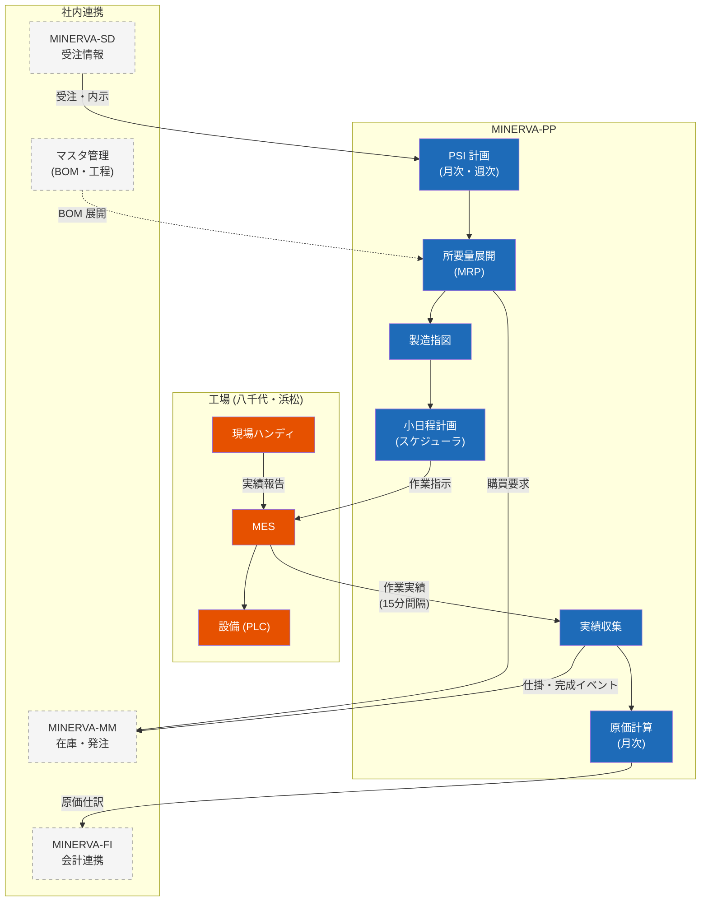

# 生産管理サブシステム（MINERVA-PP）構成

生産計画の立案から製造実績の収集までを担う。主管は製造本部 生産管理部。

## 1. 機能構成図

## 2. 計画サイクル

| 計画 | サイクル | 対象期間 | 確定タイミング |
| --- | --- | --- | --- |
| PSI 計画 | 月次 | 3 ヶ月先まで | 毎月 25 日の需給会議 |
| 週次計画 | 週次 | 2 週間先まで | 毎週木曜 15:00 |
| 小日程計画 | 日次 | 翌 2 営業日 | 前日 17:00 |

## 3. MES 連携の要点

- 作業実績は MES から **15 分間隔** でファイル連携（並行稼働中の暫定方式。API 化は Phase 2）
- 連携断が 1 時間を超えた場合、完成計上が遅延し出荷引当に影響するため **P2 障害** として扱う
- 設備からの自動実績（PLC 経由）と手入力実績（ハンディ）は入力区分で区別し、原価集計では同一に扱う

> 💡 八千代工場は 2 直、浜松工場は昼勤のみ。夜間バッチの実行時間帯設計では八千代の 2 直目（〜23:00）の実績連携を考慮すること。
