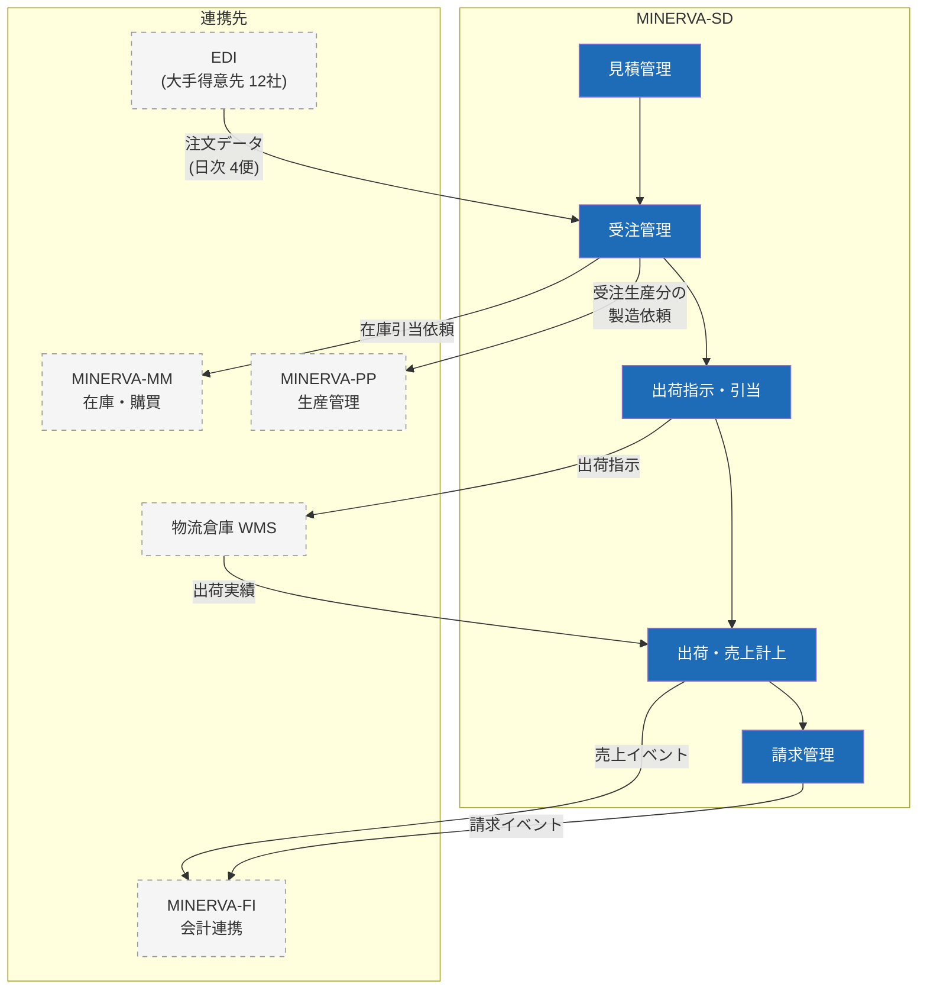

# 販売管理サブシステム（MINERVA-SD）構成

見積から請求までの販売プロセスを担うサブシステム。主管は営業本部、開発保守は情報システム部 販売Gr。

## 1. 機能構成図

## 2. 主要な業務ルール

| ルール | 内容 | 根拠 |
| --- | --- | --- |
| 与信チェック | 受注登録時に与信限度額を自動チェック。超過時は営業部長承認フローへ | 与信管理規程 第7条 |
| 引当優先順位 | 出荷予定日 → 得意先ランク → 受注日時 の順 | 営業本部運用ルール |
| 売上計上基準 | 出荷基準（一部得意先は検収基準、得意先マスタで指定） | 経理規程 |
| 請求締め | 得意先ごとの締日（5/10/15/20/25/末）で自動締め | — |

## 3. EDI 受信の流れ

- 受信便は **6:00 / 10:00 / 14:00 / 18:00** の日次 4 便
- フォーマット変換エラーは「EDI 取込エラー一覧」画面に滞留し、営業事務が当日中に補正・再取込
- 補正できない場合は先方へ再送依頼（翌便扱い）

> ⚠️ **注意**: 18:00 便の取込エラーを翌朝まで放置すると当日出荷に間に合わない。18:30 時点で滞留があれば Slack #sd-edi-alert に自動通知される。
