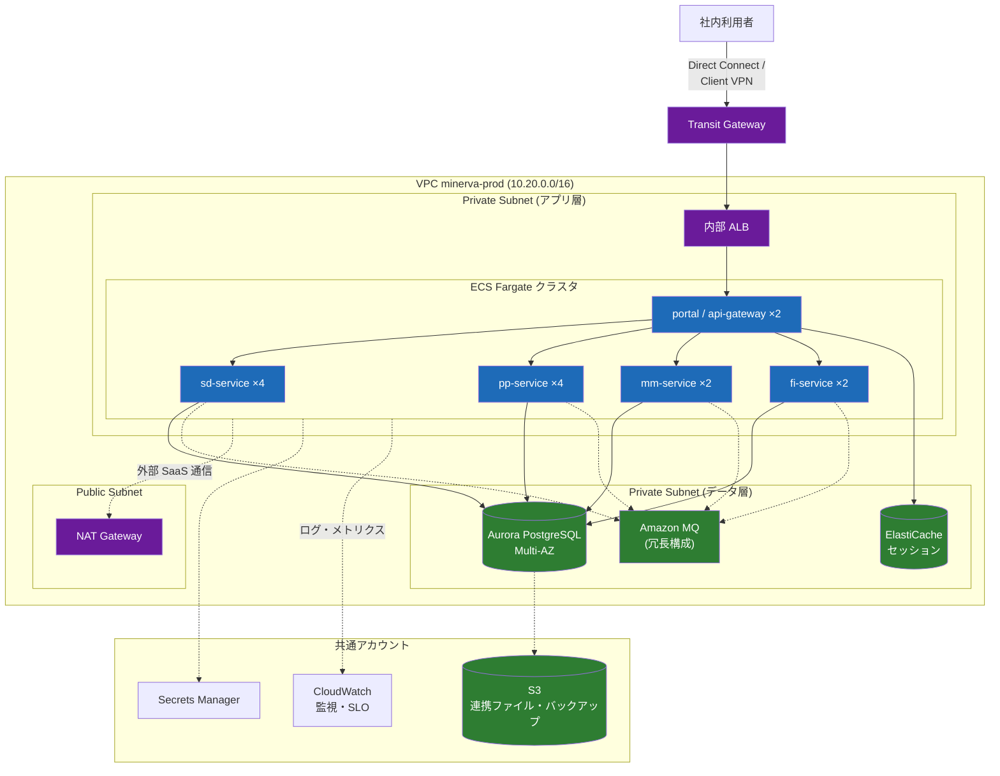

# AWS インフラ構成図

MINERVA 本番環境（PROD）の AWS 構成。DEV / STG との差分は「技術スタック・環境一覧」を参照。

## 1. ネットワーク・コンピュート構成

## 2. アカウント分離

| AWS アカウント | 用途 |
| --- | --- |
| minato-minerva-prod | 本番ワークロード |
| minato-minerva-stg | STG / DEV |
| minato-shared | 監視・ログ集約・CI/CD ランナー |
| minato-security | CloudTrail / Config / GuardDuty 集約 |

## 3. 運用上のポイント

- ECS タスク数は業務時間（7:30〜21:00）とそれ以外で Auto Scaling の下限を切替
- Aurora のフェイルオーバー試験は **半期に 1 回**、DR（別リージョン復旧）訓練は年 2 回
- 連携ファイル（EDI・MES・FB）はすべて S3 経由とし、SFTP サーバは持たない（AWS Transfer Family を利用）

> 💡 セキュリティグループの変更は Terraform 経由のみ。コンソールでの手変更は毎朝の drift 検知で検出され、#sys-minerva-infra に通知される。
