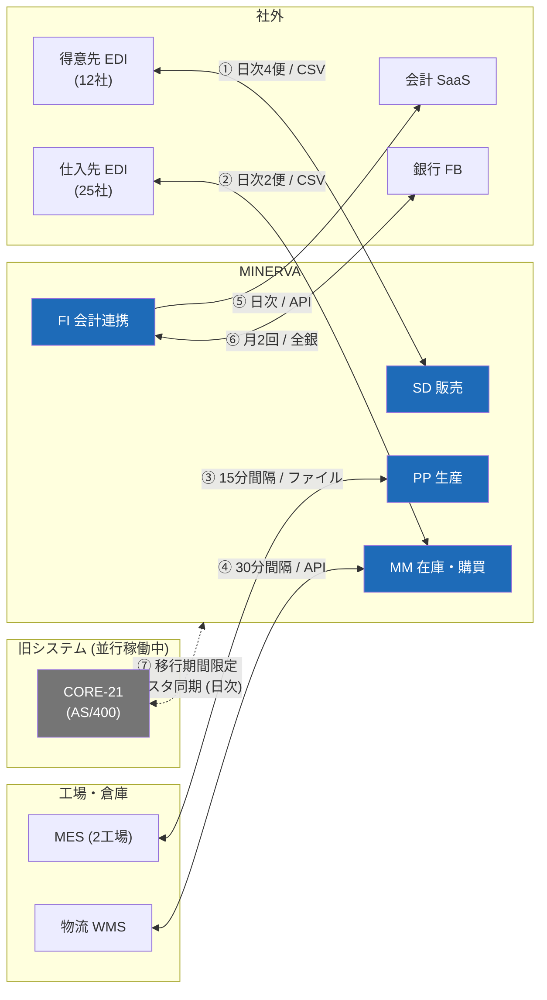

# 外部システム連携一覧

MINERVA と外部システム・旧システムの連携方式をまとめる。個別の業務仕様は各サブシステムのドキュメントを参照。

## 1. 連携全体図

## 2. 連携方式一覧

| # | 相手先 | 方向 | 方式 | 頻度 | 障害時の業務影響 |
| --- | --- | --- | --- | --- | --- |
| ① | 得意先 EDI | 双方向 | S3 + Transfer Family / CSV | 日次 4 便 | 当日出荷遅延（P2） |
| ② | 仕入先 EDI | 双方向 | S3 + Transfer Family / CSV | 日次 2 便 | 発注遅延（P3） |
| ③ | 工場 MES | 双方向 | ファイル連携 | 15 分間隔 | 完成計上遅延（P2） |
| ④ | 物流 WMS | 双方向 | REST API | 30 分間隔 | 在庫差異発生（P2） |
| ⑤ | 会計 SaaS | 送信 | REST API | 日次 22:00 | 仕訳遅延（P3、翌日再送可） |
| ⑥ | 銀行 FB | 双方向 | 全銀協手順 | 月 2 回 | 支払遅延（**P1**） |
| ⑦ | CORE-21 | 双方向 | DB 連携ツール | 日次 | マスタ不整合（P2） |

## 3. 並行稼働（CORE-21）に関する注意

> ⚠️ **2027 年 9 月末まで**、品目・取引先マスタは CORE-21 側が正。MINERVA 側での直接変更は禁止し、日次同期の取込エラーは情報システム部が当日中に解消する。
> 切替判定は移行判定会議（2027 年 7 月予定）で行う。

- 同期対象: 品目 / 取引先 / 単価 / 与信限度額
- 同期時刻: 毎日 5:30（夜間バッチ終了後）
- 差分照合レポートを毎朝 7:00 に自動生成し、#minerva-migration に投稿
