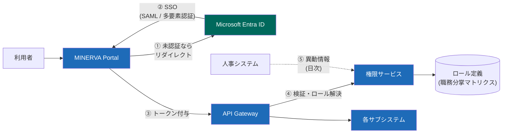

# 認証・権限管理の構成

## 1. 認証フロー

## 2. ロール設計の基本

- ロールは「部門 × 職務」で定義（例: `営業_受注担当`、`資材_発注承認者`）
- 兼務は複数ロール付与で表現。ただし **職務分掌で禁止された組合せはシステムが拒否**

| 禁止組合せ | 理由 |
| --- | --- |
| 発注承認者 × 検収担当 | 購買不正の防止 |
| 支払承認者 × 支払データ作成者 | 資金持ち出しの防止 |
| マスタ管理者 × 与信変更承認者 | 与信の恣意的変更防止 |

## 3. アカウントライフサイクル

- 入社・異動・退職は人事システムからの日次連携で自動反映（**申請レス**）
- 異動時は旧部門ロールを **30 日間の閲覧のみモード** を経て自動剥奪
- 特権 ID（本番 DB 接続等）は都度申請制・最長 8 時間・操作録画あり

> ⚠️ 監査対応: 全ロールの付与状況は四半期ごとに各部門長が棚卸し、結果を内部監査室へ提出する。棚卸未完了の部門はレポートで自動エスカレーション。
