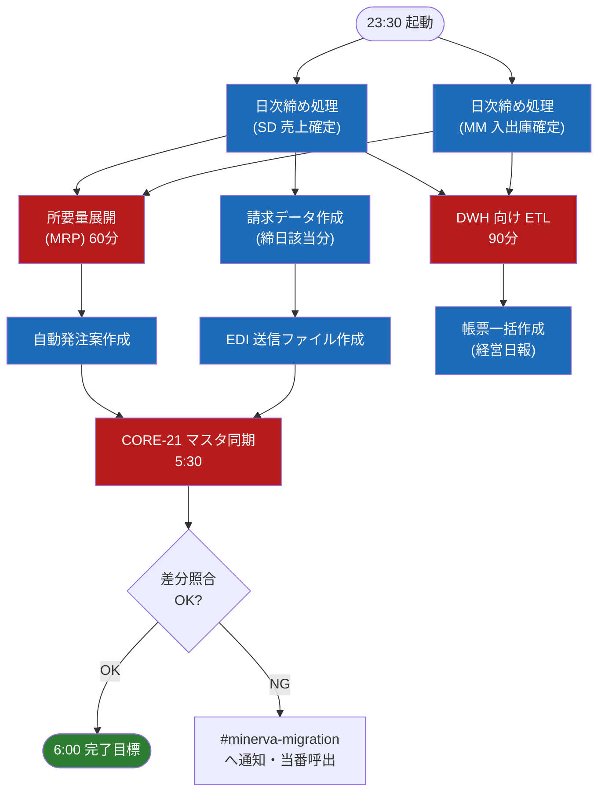

# 夜間バッチ・ジョブフロー

夜間バッチの依存関係と時刻設計。ジョブ管理は JP1 を使用。

## 1. ジョブネット依存関係

## 2. 時刻設計の考え方

| 制約 | 内容 |
| --- | --- |
| 開始 23:30 | 八千代工場 2 直目（〜23:00）の実績連携完了を待つ |
| MRP は締め後 | 未確定在庫で所要量展開すると発注数量がぶれるため |
| 完了 6:00 | 6:00 の EDI 第 1 便送信と、始業時の帳票参照に間に合わせる |

## 3. 遅延時の対応

- **4:30 時点で MRP 未完了** → 当番へ自動架電。MRP 以降を待たずに ETL・帳票系を先行実行する切替手順あり（JP1 の代替ルート）
- **6:00 時点で全体未完了** → P2 障害として扱い、「障害発生時の対応フロー」に従う
- リラン可否はジョブごとに設計済み。**請求データ作成は二重実行禁止**（リラン前に出力有無の確認必須）

> 💡 月末月初は処理量が約 3 倍になる。月初 2 営業日は開始を 23:00 に前倒しする月次カレンダーを JP1 に設定済み。
