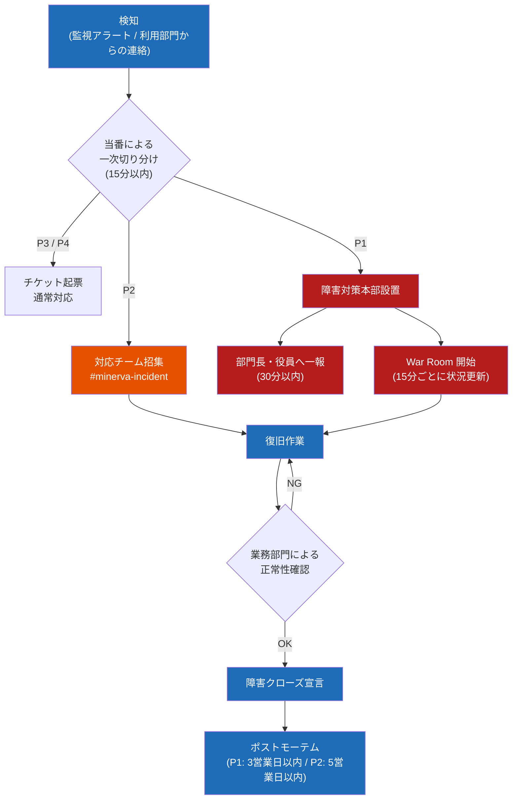

# 障害発生時の対応フロー

## 1. 障害レベル定義

| レベル | 定義 | 例 | 初動目標 |
| --- | --- | --- | --- |
| **P1** | 基幹業務の停止・資金/対外影響 | 全面ダウン、支払データ誤送信 | 15 分 |
| **P2** | 一部業務の停止・遅延 | EDI 取込不可、MES 連携断 1h 超 | 20 分 |
| **P3** | 回避策のある機能障害 | 帳票の一部出力エラー | 当日中 |
| **P4** | 軽微（表示崩れ等） | — | 翌営業日以降 |

## 2. エスカレーションフロー

## 3. 初動で必ずやること

1. **時刻と事象を記録する**（後のポストモーテムの起点になる）
2. 影響範囲を業務の言葉で表す（「○○画面がエラー」ではなく「本日出荷分の指示が出せない」）
3. 回避策の有無を業務部門と確認（手運用・旧システム代替の可否）
4. P1/P2 は **復旧より先に拡大防止**（例: 誤データ送信の疑いがあれば連携ジョブを止める）

P2 は 20 分以内に #minerva-incident へ第一報を出す（原因が未確定でも可）

## 4. 連絡先

| 役割 | 平日日中 | 夜間・休日 |
| --- | --- | --- |
| 一次対応 | 情シス運用 Gr | 輪番当番（PagerDuty 架電） |
| 業務判断（販売） | 営業企画部 | 営業本部 当直携帯 |
| 業務判断（生産） | 生産管理部 | 工場 当直長 |
| 対外連絡（銀行・EDI） | 経理部 / 資材部 | 部長経由で個別連絡 |

> ⚠️ **支払データ誤送信（P1）** は当日 14:30 までなら銀行側で組戻し可能。疑い段階でも即座に経理部長へ連絡すること。判断を待ってからの連絡では間に合わない。
