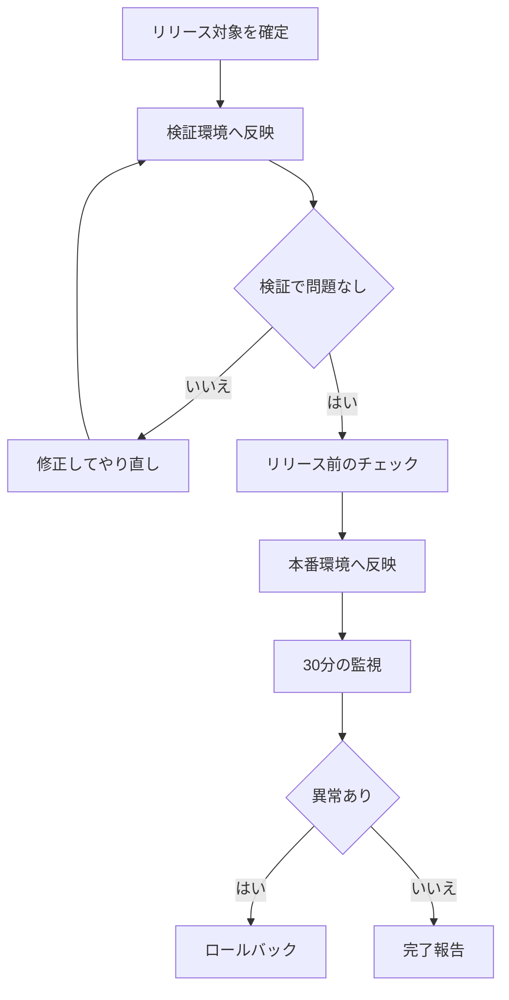

# リリースの手順

このドキュメントは、本番環境へリリースするときの進め方をまとめたものです。対象はプロダクト開発部の全メンバーです。

## 対象と前提

- 対象は、プロダクト開発部が運用するすべてのサービスです
- 変更は必ずレビューを通してから main に入れます
- 決まった曜日を待てないときは「緊急リリース」の節を読んでください

## リリースのタイミング

リリースは毎週火曜と木曜の14時に実施します。担当は当番表のとおりです。

祝日と重なる週は、前営業日の同じ時刻にずらします。年末年始と大型連休の前後3営業日はリリースを止めます。

## リリースの流れ

## 環境

| 環境 | 用途 | 反映のタイミング | 責任者 |
| --- | --- | --- | --- |
| 開発 | 各自の動作確認 | main への取り込みごとに自動 | 変更した本人 |
| 検証 | リリース前の通し確認 | リリース当日の午前 | リリース当番 |
| 本番 | お客さまが使う環境 | 火曜・木曜の14時 | リリース当番 |

検証環境のデータは毎週月曜の朝に本番から複製します。個人情報は複製のときに伏せられます。

## リリース前のチェック

当番はリリースを始める前に、次の項目をすべて確認してください。

- [ ] テストがすべて通っている
- [ ] 変更内容をリリースノートにまとめた
- [ ] すべての変更がレビュー済みである
- [ ] データベースの変更がある場合、戻し方を確認した
- [ ] 検証環境で主要な画面を一通り触った
- [ ] 問い合わせ対応チームにリリース内容を共有した

## リリース作業の手順

1. リリース対象を確定し、リリースノートを開発チャンネルに投稿する
2. 検証環境へ反映し、主要な画面を確認する
3. 上のチェックリストを埋める
4. 本番環境へ反映する
5. 開始と終了の時刻を開発チャンネルに残す

## リリース後の確認

リリース後30分は、エラーの監視画面と問い合わせチャンネルを確認してください。

見るのは次の3つです。

| 見るもの | 正常の目安 |
| --- | --- |
| エラー率 | リリース前と同じ水準 |
| 主要な画面の応答時間 | 1秒以内 |
| 問い合わせの件数 | 同じ内容の報告が続いていない |

## ロールバックの判断基準

次のどれかに当てはまったら、原因の調査より先に直前のバージョンへ戻します。

| 状況 | 判断 |
| --- | --- |
| 主要な機能が使えない | すぐ戻す |
| エラー率がリリース前の2倍を超えた | すぐ戻す |
| 一部の画面で表示が崩れている | 15分で直せるなら直す。無理なら戻す |
| 見た目の細かいずれ | 戻さず次のリリースで直す |

問題が起きた場合は、直前のバージョンに戻してから原因を調査します。判断に迷ったら当番がリードに相談してください。

> [!IMPORTANT]
> 戻すかどうかで5分以上迷ったら、戻すほうを選んでください。戻してから調べるほうが安全です。

## 緊急リリース

障害の復旧など、決まった曜日を待てない場合は緊急リリースを行います。

1. リード1名の承認をチャットまたは口頭で得る
2. 変更は復旧に必要な範囲だけにとどめる
3. リリースのあとで、通常どおりレビューを受ける
4. 翌営業日までに、なぜ急いだのかを開発チャンネルに残す
