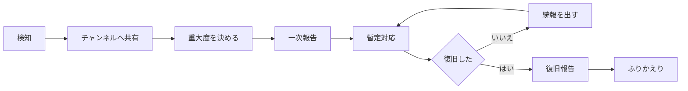

# 障害対応の流れ

このドキュメントは、サービスに障害が起きたときの動き方をまとめたものです。対象はプロダクト開発部と、お客さま対応をする全員です。

## 重大度の区分

はじめに重大度を決めます。迷ったら重いほうを選んでください。あとから下げても構いません。

| 重大度 | 状態の例 | 一次報告 | 復旧の目標 | 呼ぶ人 |
| --- | --- | --- | --- | --- |
| Sev1 | 全体が止まっている、データが壊れている | 30分以内 | 4時間以内 | 当番・リード・部長 |
| Sev2 | 主要な機能が使えない、一部のお客さまに影響 | 30分以内 | 1営業日以内 | 当番・リード |
| Sev3 | 代わりの手順がある、影響が限られている | 当日中 | 3営業日以内 | 当番 |

夜間と休日に Sev1 が起きたときは、当番表の緊急連絡先へ電話します。チャットだけで済ませないでください。

## 検知したら

障害らしき事象を見つけたら、まず障害対応チャンネルに投稿してください。自分で直せそうでも、共有が先です。

最初の投稿は、次の3つだけで構いません。

1. 何が起きているか（見えている現象）
2. いつから起きているか
3. 誰が今見ているか

## 一次報告

発生から30分以内に、影響範囲と暫定対応を一次報告としてまとめます。

一次報告は次の形で障害対応チャンネルに投稿します。

```
【一次報告】<障害の概要>
重大度: Sev2
発生時刻: 2026-09-01 14:20
影響範囲: <どの機能が、どのお客さまに>
現在の状況: 調査中 / 暫定対応中 / 復旧済み のいずれか
暫定対応: <今やっていること>
次の報告: 15:00 ごろ
対応リーダー: <名前> / 記録係: <名前>
```

分かっていない項目には「調査中」と書きます。全部が埋まるまで待たずに出してください。

## 対応の流れ



続報は、状況が変わったとき、または前の報告から1時間たったときに出します。

## 対応中の役割

対応リーダー1名と記録係1名を決めます。記録係は時系列で対応内容を残してください。

| 役割 | やること |
| --- | --- |
| 対応リーダー | 方針を決める。手は動かさず、判断と指示に集中する |
| 記録係 | 時刻つきで発言と操作を残す。報告の下書きも作る |
| 作業担当 | 調査と復旧の作業をする。やったことは必ず声に出す |
| 窓口 | お客さま対応チームと社内に状況を伝える |

人が足りないときも、対応リーダーと記録係だけは必ず分けてください。

## 復旧の判断

次がすべて確認できたら、復旧とみなします。

- [ ] 現象が再現しないことを確認した
- [ ] エラーの監視画面が平常の水準に戻った
- [ ] お客さま対応チームに復旧を伝えた
- [ ] 障害対応チャンネルに復旧報告を投稿した

## ふりかえり

復旧後3営業日以内にふりかえりを行い、再発防止策をこのドキュメントに反映します。

ふりかえりでは次の順に話します。

1. 時系列の確認（記録係のメモを読む）
2. 何が原因だったか
3. 検知が早かった、または遅れた理由
4. 次に同じことが起きたら何が変わるか
5. 決めた対策と、その担当と期限

> [!NOTE]
> ふりかえりでは人を責めません。手順と仕組みの話だけをします。
